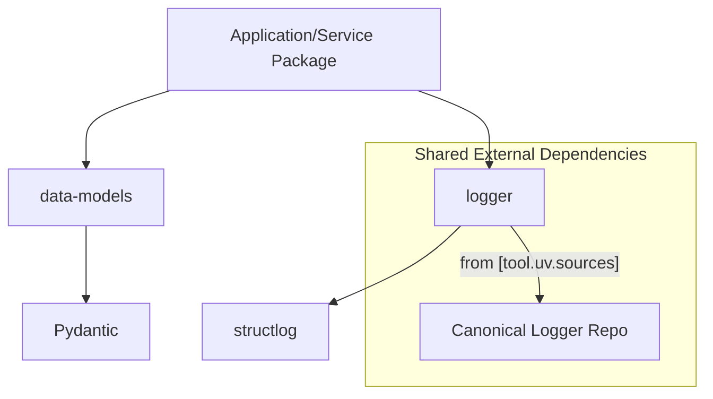

# Architecture Overview

This monorepo is designed to host multiple Python packages, enabling modular development, code reusability, and consistent tooling. The architecture emphasizes clear separation of concerns, with common functionalities encapsulated in shared packages.

## Monorepo Structure and Principles

*   **Modular Design**: Each package is an independent unit with its own `pyproject.toml` for dependency management.
*   **Shared Dependencies**: Core utilities and data models are centralized to avoid duplication and ensure consistency.
*   **Tooling**: `uv` manages Python dependencies efficiently, and `taskipy` standardizes command execution.

## Inter-Package Relationships

Packages within the monorepo often depend on each other or on external shared components:

*   **`data-models`**: This package (`/packages/data-models`) is a foundational dependency, providing shared Pydantic models for API contracts and data validation. Other packages consume these models to ensure consistent data structures.
*   **`logger`**: The `logger` package (`/packages/logger`) provides a standardized structured logging interface. While a local copy exists for reference, the canonical dependency for `logger` (and potentially other shared utilities like `data-utils` if it were present) is managed via `[tool.uv.sources]` from a shared Git repository. This ensures all projects use the same, centrally maintained logging solution.
    *   **Source of Truth**: `CLAUDE.md` outlines this approach for shared dependencies.

### Diagram: Simplified Package Dependencies

## `pyproject.toml` and `uv` Configuration

Each package's `pyproject.toml` defines its specific dependencies. The monorepo setup, particularly the `[tool.uv.sources]` section (as mentioned in `CLAUDE.md`), allows for referencing shared external repositories, enabling controlled consumption of common internal libraries like the canonical `logger`.

**Source**: `CLAUDE.md` for general monorepo conventions and shared dependency strategy.
